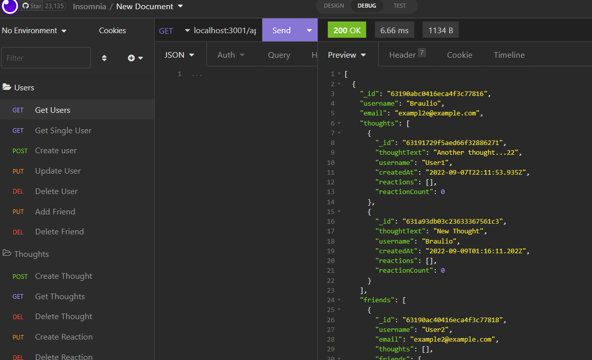

# Palfindr

## Description
This application is a Social Network REST api that allow the user to create, get, update and delete profiles, aditionally it allow you to add friends to each user and create thoughts and reactions to the thoughts.

The app was made using MongoDB, the ODM model with mongoose, and express. 

## Table of Contents

- [Usage](#usage)
- [Licence](#licence)

## Usage
Install all the packages typing npm install and then you can run the server with npm start.
Then, you can test the api using insomina

## Licence
The Unlicense

## Questions
[Github Profile](https://github.com/braulioloaizac)

Email : bloaizac@uqvirtual.edu.co

